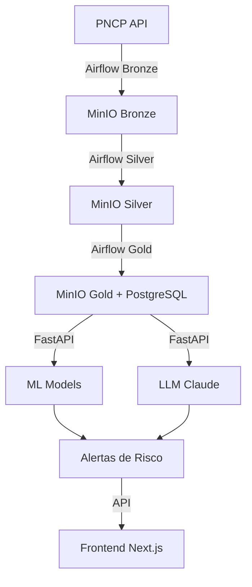

# Estrutura do Projeto - Gov Contracts AI

**Versão:** 1.0
**Data:** 22 de Outubro de 2025
**Status:** Em desenvolvimento - Fase 1 (Data Layer)

---

## 📁 Visão Geral

```
gov-contracts-ai/
├── airflow/                    # Apache Airflow - Orquestração de pipelines
├── backend/                    # FastAPI Application
├── frontend/                   # Next.js 14 Application (futuro)
├── ml/                         # ML Development & Training
├── infrastructure/             # Docker & Terraform
├── data/                       # Data Lake (montado do HDD)
├── notebooks/                  # Jupyter para análise exploratória
├── docs/                       # Documentação técnica
└── scripts/                    # Scripts utilitários
```

---

## 🔄 Airflow - Orquestração de Dados

```
airflow/
├── dags/
│   ├── bronze_ingestion.py      # DAG: Coleta dados brutos (PNCP, APIs)
│   ├── silver_processing.py     # DAG: Limpeza e validação
│   ├── gold_features.py         # DAG: Feature engineering
│   └── __init__.py
├── plugins/
│   ├── custom_operators/        # Operators customizados
│   │   └── __init__.py
│   └── __init__.py
├── config/
│   └── airflow.cfg              # Configuração Airflow
└── logs/                        # Logs de execução (gerado)
```

### Responsabilidades

- **Bronze DAG**: Ingestão diária de dados do PNCP e outras fontes
- **Silver DAG**: Validação (Great Expectations), limpeza, normalização
- **Gold DAG**: Geração de features para ML, cálculo de risk_score

---

## 🚀 Backend - FastAPI Application

```
backend/
├── app/
│   ├── core/                    # Configurações e clients
│   │   ├── __init__.py
│   │   ├── config.py            # Settings (Pydantic)
│   │   ├── minio_client.py      # Cliente S3/MinIO
│   │   └── pncp_client.py       # Cliente API PNCP
│   │
│   ├── api/                     # Endpoints REST
│   │   ├── v1/
│   │   │   └── endpoints/
│   │   │       ├── alerts.py    # GET/POST /alerts
│   │   │       ├── analysis.py  # POST /analyze
│   │   │       └── health.py    # GET /health
│   │   └── deps.py              # Dependencies (DB, auth)
│   │
│   ├── models/                  # Schemas
│   │   ├── database.py          # SQLAlchemy models
│   │   └── schemas.py           # Pydantic schemas (API)
│   │
│   ├── services/                # Business logic
│   │   ├── __init__.py
│   │   ├── data_collector.py    # Coleta de dados
│   │   ├── data_validator.py    # Validações
│   │   └── data_transformer.py  # Transformações
│   │
│   ├── ml/                      # ML Inference
│   │   ├── model_loader.py      # Carrega modelos do MLflow
│   │   ├── inference.py         # Predição
│   │   └── explainer.py         # SHAP values
│   │
│   ├── ai/                      # AI Generativa
│   │   ├── llm_client.py        # Claude/GPT client
│   │   ├── prompts.py           # Templates de prompts
│   │   └── rag.py               # RAG pipeline
│   │
│   ├── utils/                   # Utilitários
│   │   ├── __init__.py
│   │   ├── logger.py            # Loguru config
│   │   └── metrics.py           # Prometheus metrics
│   │
│   ├── workers/                 # Async tasks
│   │   ├── celery_app.py        # Celery config
│   │   └── tasks.py             # Background jobs
│   │
│   └── main.py                  # FastAPI app instance
│
├── tests/                       # Testes
│   ├── conftest.py              # Fixtures pytest
│   ├── unit/
│   ├── integration/
│   └── e2e/
│
├── alembic/                     # DB Migrations
│   └── versions/
│
├── pyproject.toml               # Poetry dependencies
├── poetry.lock
└── README.md
```

### Responsabilidades

- **API REST**: Expor endpoints para análise de processos
- **ML Inference**: Carregar e executar modelos de ML
- **AI Integration**: LLM para fundamentação de alertas
- **Data Services**: Coleta, validação e transformação

---

## 🧠 ML - Machine Learning Development

```
ml/
├── data/                        # Datasets (DVC tracked)
│   ├── raw/
│   ├── processed/
│   └── features/
│
├── notebooks/                   # Experimentação
│   ├── 01_eda.ipynb
│   ├── 02_feature_engineering.ipynb
│   └── 03_model_training.ipynb
│
├── src/                         # Código de treinamento
│   ├── data/
│   │   ├── ingestion.py
│   │   └── validation.py
│   ├── features/
│   │   └── build_features.py
│   └── models/
│       ├── train.py
│       ├── evaluate.py
│       └── export.py
│
├── configs/
│   ├── model_config.yaml
│   └── feature_config.yaml
│
├── dvc.yaml                     # DVC pipeline
├── params.yaml
└── requirements.txt
```

### Responsabilidades

- **Treinamento**: Treinar modelos XGBoost com Optuna
- **Experimentos**: MLflow tracking
- **Versionamento**: DVC para dados e modelos
- **Avaliação**: Métricas de precisão, recall, F1

---

## 🏗️ Infrastructure - Docker & Terraform

```
infrastructure/
├── docker/
│   ├── docker-compose.yml       # Todos os serviços
│   ├── minio/
│   │   ├── Dockerfile
│   │   └── init-buckets.sh
│   ├── postgres/
│   │   ├── Dockerfile
│   │   ├── postgresql.conf
│   │   └── init-scripts/
│   ├── redis/
│   │   ├── Dockerfile
│   │   └── redis.conf
│   └── airflow/
│       └── Dockerfile
│
└── terraform/                   # IaC (futuro - AWS)
    ├── main.tf
    ├── variables.tf
    └── modules/
```

### Serviços Docker

| Serviço | Porta | Descrição |
|---------|-------|-----------|
| **MinIO** | 9000, 9001 | Object Storage (Data Lake) |
| **PostgreSQL** | 5433 | Data Warehouse + pgvector |
| **Redis** | 6380 | Cache e message broker |
| **Airflow Webserver** | 8081 | UI do Airflow |
| **Airflow Scheduler** | - | Scheduler de DAGs |
| **MLflow** | 5000 | Tracking server |

---

## 💾 Data - Data Lake (Medallion Architecture)

```
data/                            # Montado de /mnt/d/minio/data
├── bronze/                      # Raw data (Parquet)
│   ├── licitacoes/
│   │   └── year=2025/month=10/day=22/
│   ├── editais/
│   └── precos_mercado/
│
├── silver/                      # Clean data (Parquet)
│   ├── licitacoes_clean/
│   └── editais_parsed/
│
└── gold/                        # ML-ready features (Parquet + PostgreSQL)
    └── licitacoes_features/
```

### Camadas

- **Bronze**: Dados brutos, append-only, particionado por data
- **Silver**: Validado (Great Expectations), deduplicado
- **Gold**: Features calculadas, otimizado para queries

---

## 📊 Notebooks - Análise Exploratória

```
notebooks/
├── exploratory_analysis.ipynb   # EDA inicial
├── .gitkeep
└── [futuras análises]
```

### Uso

- Análise exploratória de dados (EDA)
- Prototipagem de features
- Visualizações
- Experimentos rápidos

---

## 📝 Docs - Documentação Técnica

```
docs/
├── README.md                    # Índice de documentação
├── architecture.md              # Arquitetura do sistema
├── data-dictionary.md           # Dicionário de dados
├── technology-decisions.md      # Decisões técnicas
├── terminology-guide.md         # Terminologia oficial
├── commit-conventions.md        # Convenções de commits
├── infrastructure.md            # Guia de infraestrutura
├── project-structure.md         # Este arquivo
├── PRD.md                       # Product Requirements Document
└── day-by-day/                  # Logs diários
    └── 2025-10-11.md
```

---

## 🔧 Scripts - Utilitários

```
scripts/
└── [scripts de automação futuros]
```

### Exemplos Futuros

- `setup_local.sh` - Setup ambiente local
- `backup_db.sh` - Backup PostgreSQL
- `sync_data.sh` - Sync data lake

---

## 📦 Arquivos de Configuração Raiz

```
gov-contracts-ai/
├── .gitignore                   # Git ignore rules
├── .dockerignore                # Docker ignore
├── .pre-commit-config.yaml      # Pre-commit hooks
├── docker-compose.yml           # Link para infrastructure/docker/
├── Makefile                     # Comandos comuns
├── README.md                    # README principal
├── CLAUDE.md                    # Instruções para Claude Code
├── LICENSE                      # GPL v3.0
└── CHANGELOG.md                 # Histórico de mudanças
```

---

## 🚧 Status de Implementação

### ✅ Implementado (Fase 1)

- [x] Estrutura de diretórios
- [x] Docker Compose (MinIO, PostgreSQL, Redis)
- [x] Backend básico (FastAPI + config)
- [x] Documentação inicial
- [x] Pre-commit hooks
- [x] Makefile

### 🚧 Em Desenvolvimento

- [ ] Airflow DAGs (bronze/silver/gold)
- [ ] Clientes (MinIO, PNCP)
- [ ] Services (data_collector, validator, transformer)
- [ ] Testes unitários
- [ ] Pipeline de dados completo

### 📋 Próximas Fases

**Fase 2: ML Pipeline**
- [ ] Feature engineering
- [ ] Treinamento XGBoost
- [ ] MLflow integration
- [ ] Model serving

**Fase 3: AI Layer**
- [ ] LLM integration (Claude/GPT)
- [ ] RAG pipeline
- [ ] Alert justification

**Fase 4: Frontend**
- [ ] Next.js 14 setup
- [ ] Dashboard
- [ ] Visualizações

---

## 🔗 Relação entre Componentes



---

## 📚 Convenções

### Nomenclatura de Arquivos

- **Python**: `snake_case.py`
- **Configuração**: `kebab-case.yaml`, `snake_case.conf`
- **Documentação**: `kebab-case.md`
- **Notebooks**: `snake_case.ipynb`

### Nomenclatura de Variáveis

- **Scores**: `risk_score` (não `fraud_score`)
- **Flags**: `has_critical_alerts` (não `is_fraud`)
- **IDs**: `process_id`, `procurement_id`

### Imports

```python
# Standard library
import os
from datetime import datetime

# Third-party
import pandas as pd
from fastapi import FastAPI

# Local
from app.core.config import settings
from app.services.data_collector import DataCollector
```

---

## 🔍 Como Navegar no Projeto

### Para Desenvolvimento Backend

1. `backend/app/main.py` - Entry point
2. `backend/app/core/config.py` - Configurações
3. `backend/app/api/v1/endpoints/` - Endpoints
4. `backend/tests/` - Testes

### Para Desenvolvimento ML

1. `ml/notebooks/` - Experimentação
2. `ml/src/` - Código de produção
3. `ml/configs/` - Hyperparâmetros

### Para Infraestrutura

1. `infrastructure/docker/docker-compose.yml` - Serviços
2. `infrastructure/docker/*/` - Configurações específicas
3. `Makefile` - Comandos rápidos

### Para Documentação

1. `docs/README.md` - Índice
2. `docs/architecture.md` - Visão geral técnica
3. `CLAUDE.md` - Guia de desenvolvimento

---

## 🆘 Troubleshooting

### Problemas Comuns

**Permissões no diretório `airflow/`:**
- Owner: UID 50000 (container Airflow)
- Use Docker exec para editar arquivos lá

**Portas ocupadas:**
- PostgreSQL: 5433 (não 5432)
- Redis: 6380 (não 6379)
- MinIO: 9000/9001 (não 9000/9001)

**Data directory não existe:**
```bash
mkdir -p /mnt/d/minio/data
```

---

## 📖 Referências

- [Architecture](architecture.md) - Diagrama detalhado
- [Technology Decisions](technology-decisions.md) - Justificativas técnicas
- [Terminology Guide](terminology-guide.md) - Nomenclatura oficial
- [Commit Conventions](commit-conventions.md) - Padrão de commits

---

*Última atualização: 22/10/2025*
*Mantido por: Equipe de Desenvolvimento*
